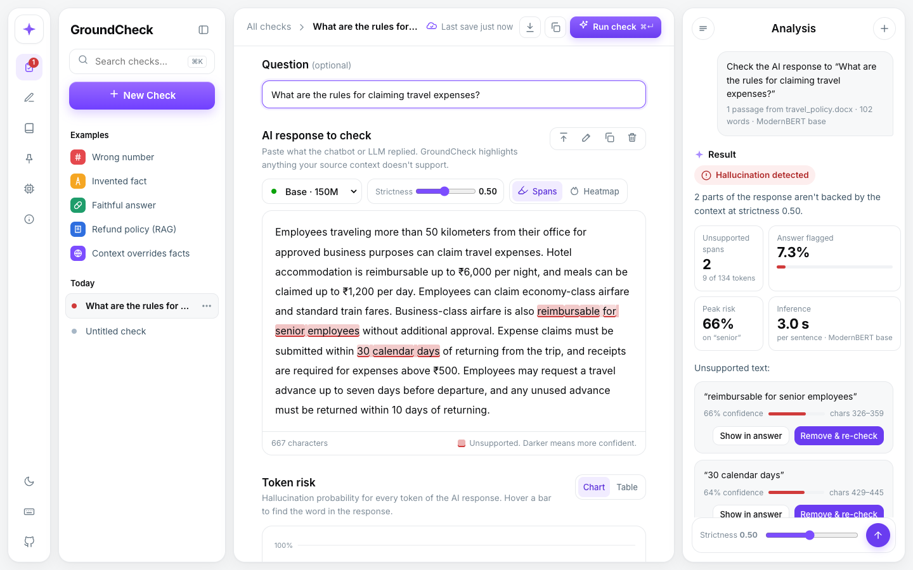

# GroundCheck

**Span-level hallucination detection for AI responses, with a local dashboard.**

Paste (or upload) the source documents and the AI's response. GroundCheck highlights the parts
of the response the sources don't support, scores every token, and shows how the result changes
with strictness.



Built on [LettuceDetect](https://github.com/KRLabsOrg/LettuceDetect) (MIT) by KR Labs, a ModernBERT
token classifier fine-tuned on RAGTruth. Everything runs locally; no API keys needed.

## Quick start

```bash
python3 -m venv .venv
.venv/bin/pip install -r app/requirements.txt
.venv/bin/python app/server.py
```

Open http://127.0.0.1:8765. The first check downloads the detection model (~600 MB).

## Features

- Highlighted unsupported spans, a per-token risk chart and heatmap, and a JSON report export
- Upload PDF, DOCX, TXT or MD files as source context (or as the response to check)
- Per-sentence scoring, which catches contradictions a whole-answer pass misses
- A strictness trade-off table (0.30 / 0.50 / 0.70 / 0.80)
- Saved checks with search, pinning and examples; light and dark themes

See [app/README.md](app/README.md) for how detection works, the API, and known limits.

## Repository layout

| Path | What it is |
|---|---|
| `app/server.py` | FastAPI backend: detection, file extraction |
| `app/static/index.html` | The dashboard (single file, no build step) |
| `verify_lettucedetect.py` | Standalone sanity checks for the underlying model |
